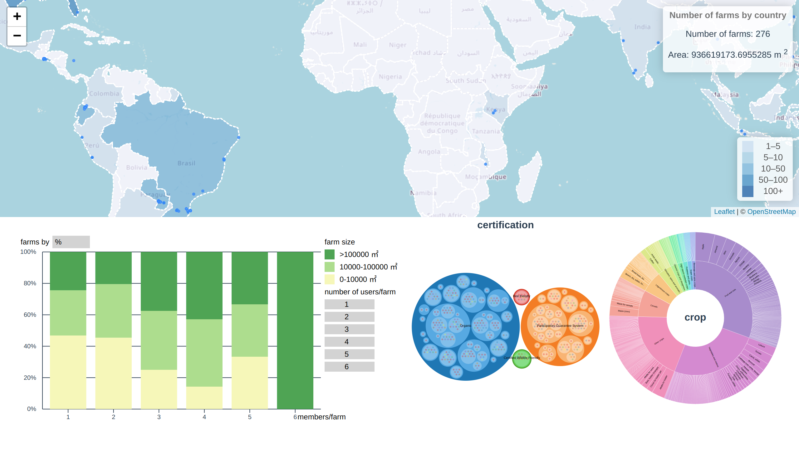

# Project

### [demo](https://litefarm-visualization.vercel.app/)

### Install packages

```
npm i pnpm -g
pnpm i
```

### Start dev server

```
pnpm dev
```



### Credits

[bubble chart](https://observablehq.com/@ahoak/d3-api-analysis)

Bubble chart was rewritten into class syntax. We also added interaction between charts.

[sunburst chart](https://observablehq.com/@ahoak/d3-sunburst-chart)

Sunburst chart was rewritten into class syntax. We also added interaction between charts.
